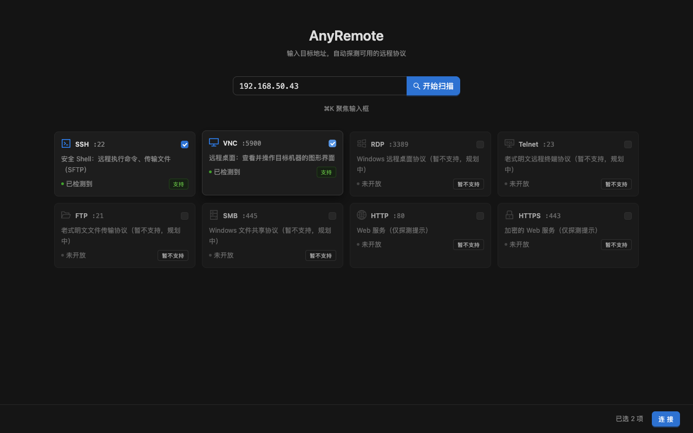
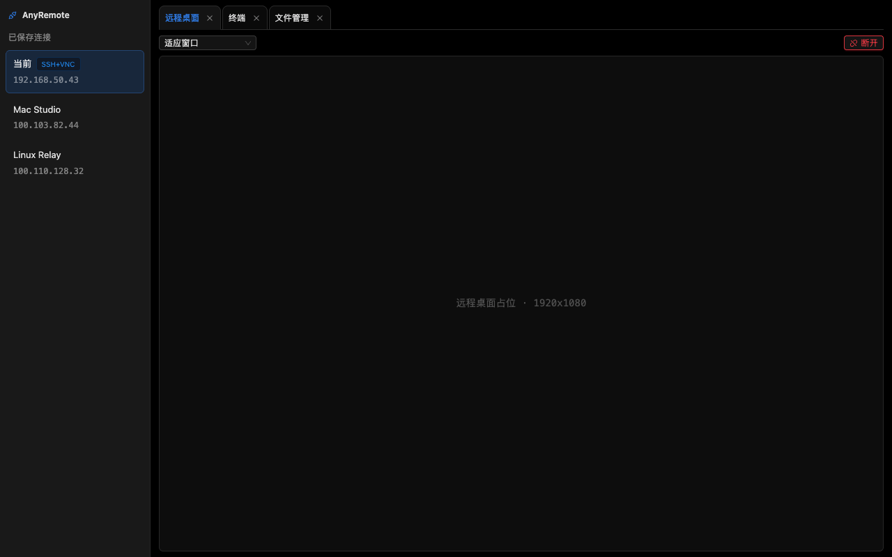
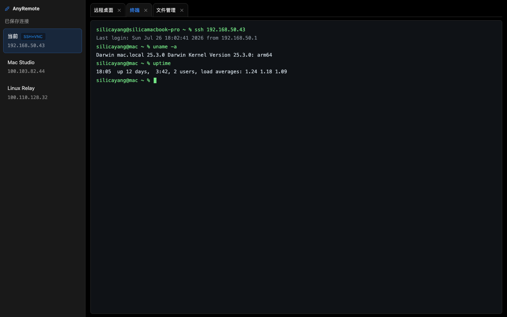
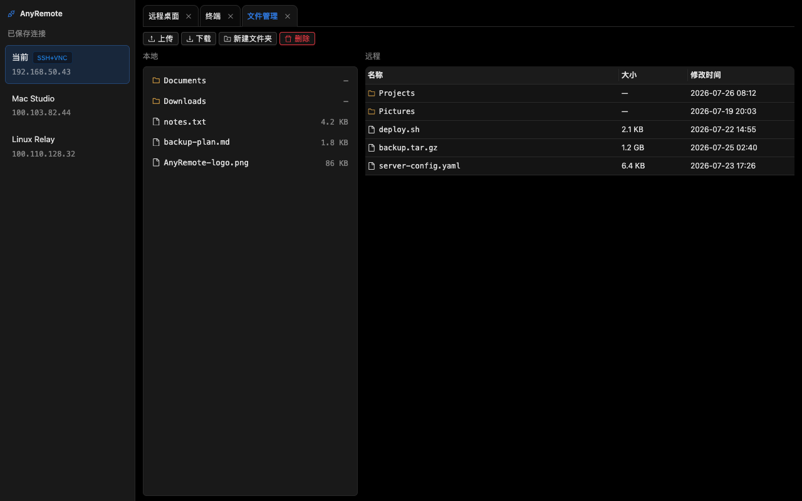

# AnyRemote

[](https://github.com/terayang/AnyRemote/actions/workflows/ci.yml)

[English](#english) | [中文](#中文)

---

## 中文

AnyRemote 是一个跨平台（macOS / Windows）桌面远程会话管理器：输入目标 IP，自动探测其可用的远程协议（SSH / VNC / RDP / Telnet / FTP / SMB / HTTP(S)），多选后一键建立远程桌面、SSH 终端与 SFTP 文件管理会话。体验对标 1Remote / Tabby / Termius。

### 截图

| 协议自动探测 | 远程桌面（VNC） |
|:-:|:-:|
|  |  |

| SSH 终端 | SFTP 文件管理 |
|:-:|:-:|
|  |  |

### 功能

- **协议自动探测**：对目标 IP 并发探测常见端口 + 协议指纹识别，以卡片形式展示，每张卡片附一句通俗说明，支持多选
- **VNC 远程桌面**：noVNC 渲染 + 主进程智能桥接，支持 macOS Screen Sharing（Apple DH 认证）与标准 VNC 密码认证，支持适应窗口 / 原始尺寸缩放
- **SSH 终端**：xterm.js + ssh2，支持密码与私钥认证
- **SFTP 文件管理**：远程文件浏览、上传 / 下载、新建 / 删除 / 重命名
- **连接管理**：保存主机配置，凭据经 Electron safeStorage（系统钥匙串 / DPAPI）加密存储
- **多标签会话**：同一 / 不同目标的多协议会话以标签页并存
- **国际化**：界面默认简体中文，内置英文（en-US）

> RDP / Telnet / FTP / SMB / HTTP(S) 当前仅探测展示，实际连接见 Roadmap。

### 下载与安装

每次 CI 构建（push 到 main 或 PR）都会产出安装包并上传为 Actions artifacts，在对应 [workflow run 页面](https://github.com/terayang/AnyRemote/actions/workflows/ci.yml)底部下载：

- `anyremote-macos`：`AnyRemote-<version>-mac-arm64.dmg`（Apple Silicon）与 `AnyRemote-<version>-mac-x64.dmg`（Intel）
- `anyremote-windows`：`AnyRemote-<version>-win-x64.exe`（NSIS 安装包，当前用户安装，可选安装目录，创建桌面快捷方式）

**安装包未做代码签名**，首次启动会被系统安全机制拦截，属正常现象：

- **macOS**：右键（Control+点击）`AnyRemote.app` →「打开」→ 再次确认「打开」
- **Windows**：SmartScreen 蓝色提示中点「更多信息」→「仍要运行」

详细指引见 [docs/RELEASE.md](docs/RELEASE.md)。

### 本地构建安装包

```bash
npm install
npm run dist       # macOS：arm64 + x64 两个 dmg → dist/
npm run dist:win   # Windows NSIS 安装包（需在 Windows 上运行）
npm run dist:all   # 构建当前平台支持的全部目标
```

### 开发

```bash
npm install        # 安装依赖
npm run dev        # 启动开发模式（electron-vite dev，HMR）
npm test           # 运行单元测试（vitest）
npm run typecheck  # TypeScript 类型检查（tsc --noEmit）
npm run build      # 构建产物到 out/（electron-vite build）
npm run smoke      # Playwright Electron 冒烟（需先 npm run build）
```

### 技术架构

Electron 主进程（Node.js）承载全部网络与协议层——协议指纹扫描器、ssh2 的 SSH/SFTP 会话、WS↔TCP VNC 桥接（内置 Apple DH 认证握手，连接 macOS Screen Sharing 无需改系统配置）；渲染进程为 React 18 + antd v5 + zustand + i18next，远程桌面用 noVNC、终端用 xterm.js；凭据经 Electron safeStorage 加密落盘。完整选型理由与模块结构见 [docs/ARCHITECTURE.md](docs/ARCHITECTURE.md)，打包发布见 [docs/RELEASE.md](docs/RELEASE.md)。

### Roadmap

- RDP / Telnet / FTP 实际连接（当前仅探测展示）
- SMB / HTTP(S) 的深度集成
- 更多界面语言（当前简体中文 + 英文，i18n 框架可扩展）

### 目录结构

```
anyremote/
├─ src/
│  ├─ main/        # Electron 主进程（网络与协议层）
│  ├─ preload/     # contextBridge 安全暴露 API
│  ├─ renderer/    # React UI（pages / components / store / i18n）
│  └─ shared/      # 主/渲染共享类型与协议常量
├─ tests/          # vitest 单元 / 集成测试
├─ build/          # 应用图标（icon.png / icon.icns）
├─ docs/           # 架构、设计与发布文档
└─ .github/        # CI（macOS + Windows 双平台矩阵 + 打包产物）
```

### License

[MIT](LICENSE) © 2026 Silica Yang

---

## English

AnyRemote is a cross-platform (macOS / Windows) desktop remote session manager: enter a target IP, auto-detect its available remote protocols (SSH / VNC / RDP / Telnet / FTP / SMB / HTTP(S)), pick several, and connect in one click — remote desktop, SSH terminal, and SFTP file management in a single app, on par with 1Remote / Tabby / Termius.

### Screenshots

| Protocol auto-detection | Remote desktop (VNC) |
|:-:|:-:|
|  |  |

| SSH terminal | SFTP file manager |
|:-:|:-:|
|  |  |

### Features

- **Protocol auto-detection**: concurrent probing of common ports with protocol fingerprinting, shown as selectable cards with plain-language descriptions
- **VNC remote desktop**: noVNC rendering + smart main-process bridge; supports macOS Screen Sharing (Apple DH auth) and standard VNC password auth, with fit-to-window / native-size scaling
- **SSH terminal**: xterm.js + ssh2, password and private-key authentication
- **SFTP file manager**: browse, upload / download, create / delete / rename remote files
- **Connection management**: saved host configurations with credentials encrypted via Electron safeStorage (Keychain / DPAPI)
- **Multi-tab sessions**: concurrent sessions of different protocols and targets in tabs
- **i18n**: Simplified Chinese by default, English (en-US) built in

> RDP / Telnet / FTP / SMB / HTTP(S) are detection-only for now; see the roadmap.

### Download & install

Every CI build (push to main or PR) produces installers and uploads them as Actions artifacts — grab them at the bottom of the corresponding [workflow run page](https://github.com/terayang/AnyRemote/actions/workflows/ci.yml):

- `anyremote-macos`: `AnyRemote-<version>-mac-arm64.dmg` (Apple Silicon) and `AnyRemote-<version>-mac-x64.dmg` (Intel)
- `anyremote-windows`: `AnyRemote-<version>-win-x64.exe` (NSIS installer, per-user install, selectable install directory, desktop shortcut)

**The installers are not code-signed**, so the OS will warn on first launch — this is expected:

- **macOS**: right-click (Control-click) `AnyRemote.app` → **Open** → confirm **Open** again
- **Windows**: on the blue SmartScreen prompt, click **More info** → **Run anyway**

See [docs/RELEASE.md](docs/RELEASE.md) for details.

### Build installers locally

```bash
npm install
npm run dist       # macOS: arm64 + x64 dmgs → dist/
npm run dist:win   # Windows NSIS installer (must run on Windows)
npm run dist:all   # every target buildable on the current platform
```

### Development

```bash
npm install        # install dependencies
npm run dev        # start dev mode (electron-vite dev, HMR)
npm test           # run unit tests (vitest)
npm run typecheck  # TypeScript type check (tsc --noEmit)
npm run build      # build to out/ (electron-vite build)
npm run smoke      # Playwright Electron smoke tests (run npm run build first)
```

### Architecture

The Electron main process (Node.js) carries the entire network & protocol layer — a protocol fingerprint scanner, SSH/SFTP sessions via ssh2, and a WS↔TCP VNC bridge with a built-in Apple DH auth handshake (connect to macOS Screen Sharing without changing system settings). The renderer is React 18 + antd v5 + zustand + i18next, with noVNC for the remote desktop and xterm.js for the terminal; credentials are encrypted via Electron safeStorage. Full rationale and module layout: [docs/ARCHITECTURE.md](docs/ARCHITECTURE.md); packaging & release: [docs/RELEASE.md](docs/RELEASE.md).

### Roadmap

- Actual RDP / Telnet / FTP connections (detection-only today)
- Deeper SMB / HTTP(S) integration
- More UI languages (Simplified Chinese + English today; the i18n framework is extensible)

### Project layout

```
anyremote/
├─ src/
│  ├─ main/        # Electron main process (network & protocol layer)
│  ├─ preload/     # contextBridge-safe API exposure
│  ├─ renderer/    # React UI (pages / components / store / i18n)
│  └─ shared/      # Types & protocol constants shared by main/renderer
├─ tests/          # vitest unit / integration tests
├─ build/          # App icons (icon.png / icon.icns)
├─ docs/           # Architecture, design & release documents
└─ .github/        # CI (macOS + Windows matrix + packaged artifacts)
```

### License

[MIT](LICENSE) © 2026 Silica Yang
